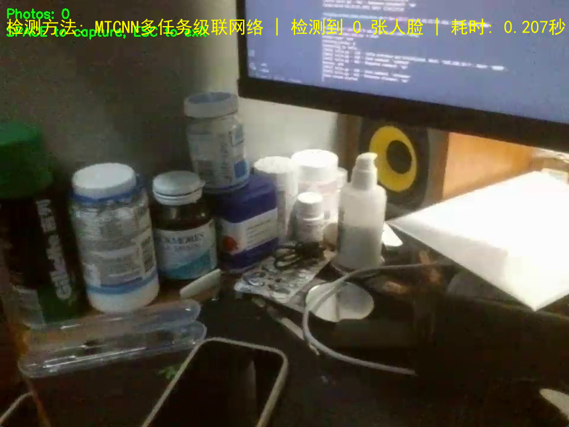
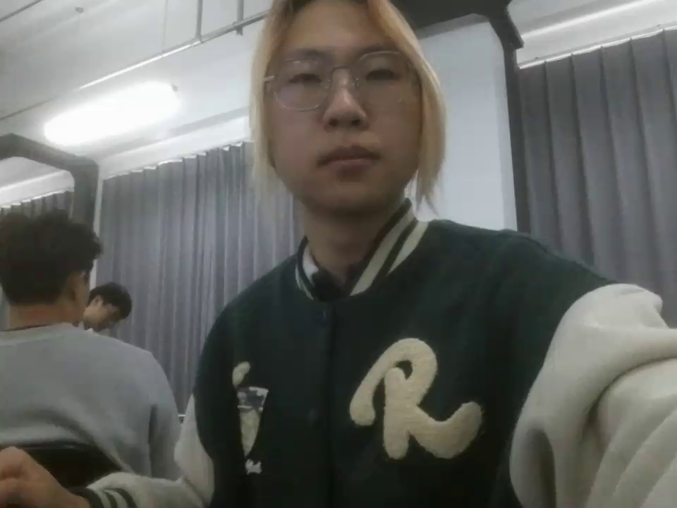
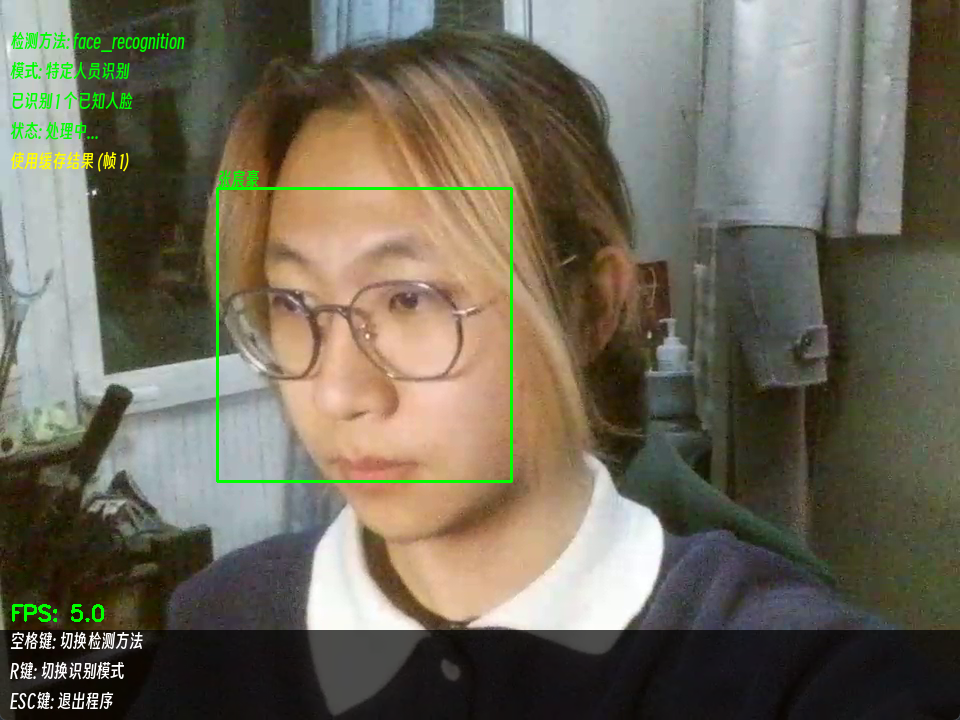
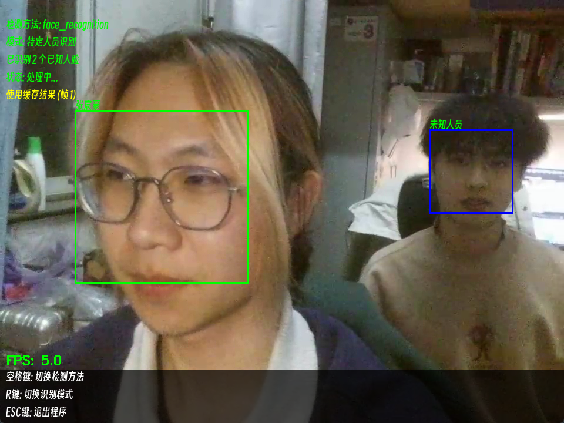

# 从Haar到face_recognition：Tello无人机人脸识别技术升级指南

WARNING：本文给出的所有代码都是示例，主要作用是展示原理，不是真正实现，真正实现或生产环境请参考完整项目，我已经发布到 Github：[TelloFace](https://github.com/KraHsu/TelloFace)

## 〇、环境准备
**需要安装的库**（终端执行）：
```bash
pip install opencv-python dlib face_recognition mtcnn opencv-contrib-python
```
当然也可以直接使用我写好的项目 [TelloFace](https://github.com/KraHsu/TelloFace)，参照`README`进行配置

---

## 一、基础版：OpenCV+Haar级联检测
### 1.1 基础检测实现
```python
import cv2

# 加载Haar级联分类器
face_cascade = cv2.CascadeClassifier("haarcascade_frontalface_default.xml")

def detect_haar(frame):
    gray = cv2.cvtColor(frame, cv2.COLOR_BGR2GRAY)
    faces = face_cascade.detectMultiScale(
        gray, 
        scaleFactor=1.3,  # 缩小检测步长
        minNeighbors=5,   # 降低误检
        minSize=(30,30)   # 适配无人机视角
    )
    return faces
```


通过调整 Haar 的参数可以一定程度上解决误识别问题，详见 [回复](./reply.md)

```python
import cv2

# 加载Haar级联分类器
face_cascade = cv2.CascadeClassifier("haarcascade_frontalface_default.xml")

def detect_haar(frame):
    gray = cv2.cvtColor(frame, cv2.COLOR_BGR2GRAY)
    faces = face_cascade.detectMultiScale(
        gray, 
        scaleFactor=1.05,  # 缩小检测步长
        minNeighbors=8,    # 降低误检
        minSize=(120,120)  # 适配无人机视角
    )
    return faces
```


### 1.2 常见问题解决
```python
# 光线补偿技巧（解决过暗问题）
gray = cv2.equalizeHist(gray) 

# 多尺度检测（解决大小脸问题）
faces = face_cascade.detectMultiScale(gray, scaleFactor=1.05, minNeighbors=3)
```

---

## 二、升级版：OpenCV DNN模型
### 2.1 YuNet模型部署
```python
def detect_dnn(frame):
    # 下载模型文件：https://github.com/opencv/opencv_zoo/tree/main/models/face_detection_yunet
    model = cv2.FaceDetectorYN.create(
        "face_detection_yunet_2022mar.onnx",
        "",
        (320, 320),  # 输入尺寸
        score_threshold=0.8  # 置信度阈值
    )
    
    # 推理处理
    h, w = frame.shape[:2]
    model.setInputSize((w, h))
    _, results = model.detect(frame)
    
    return results[:,:-1].astype(int)  # 返回(x,y,w,h)格式
```
参考链接：[DNN-based Face Detection And Recognition](https://docs.opencv.org/4.x/d0/dd4/tutorial_dnn_face.html)


### 2.2 性能优化技巧
```python
# 降低输入分辨率（牺牲精度换速度）
model.setInputSize((160, 160)) 

# 启用CUDA加速（需要安装GPU版OpenCV）
cv2.cuda.setDevice(0)
model = cv2.FaceDetectorYN.create(..., backend_id=cv2.dnn.DNN_BACKEND_CUDA)
```

---

## 三、进阶版：MTCNN检测
### 3.1 多角度人脸检测
```python
from mtcnn import MTCNN

detector = MTCNN(
    steps_threshold=[0.6, 0.7, 0.9]  # 调整检测阈值
)

def detect_mtcnn(frame):
    rgb = cv2.cvtColor(frame, cv2.COLOR_BGR2RGB)
    results = detector.detect_faces(rgb)
    
    faces = []
    for res in results:
        if res['confidence'] > 0.9:  # 过滤低置信度结果
            x, y, w, h = res['box']
            faces.append((x, y, w, h))
    
    return faces
```




---

## 四、终极版：face_recognition库
### 4.1 人脸特征注册
```python
import face_recognition
import os

known_encodings = []
known_names = []

# 读取训练图片
for img_file in os.listdir("known_faces"):
    image = face_recognition.load_image_file(f"known_faces/{img_file}")
    encoding = face_recognition.face_encodings(image)[0]
    
    known_encodings.append(encoding)
    known_names.append(img_file.split(".")[0])  # 文件名作为人名
```



### 4.2 实时识别实现
```python
def recognize_face(frame):
    # 检测所有人脸
    rgb = cv2.cvtColor(frame, cv2.COLOR_BGR2RGB)
    face_locations = face_recognition.face_locations(rgb)
    
    # 提取特征
    face_encodings = face_recognition.face_encodings(rgb, face_locations)
    
    # 比对数据库
    names = []
    for encoding in face_encodings:
        matches = face_recognition.compare_faces(known_encodings, encoding, tolerance=0.5)
        name = "Unknown"
        
        # 计算最接近的匹配
        face_distances = face_recognition.face_distance(known_encodings, encoding)
        best_match = np.argmin(face_distances)
        
        if matches[best_match]:
            name = known_names[best_match]
        
        names.append(name)
    
    return face_locations, names
```




---

## 五、关键调试技巧
### 5.1 通用参数调整
```python
# face_recognition参数优化
face_locations = face_recognition.face_locations(
    rgb, 
    number_of_times_to_upsample=1,  # 减少上采样次数（默认1）
    model="hog"  # 切换模型：cnn精度高但耗资源
)
```

### 5.2 性能平衡方案
```python
# 分级检测策略
if 光线条件好:
    使用face_recognition(cnn模式)
elif 电量低于30%:
    使用OpenCV DNN
else:
    使用MTCNN
```

### 5.3 常见错误处理
```text
错误1：dlib无法导入
解决方案：安装VS Build Tools，更新cmake

错误2：face_locations返回空列表
检查项：确认图片为RGB格式，尝试调整upsample参数

错误3：识别结果不稳定
优化方案：添加移动平均滤波，连续3帧相同结果才确认
```

---

## 六、完整流程总结
1. 准备至少10张/人的多角度照片（建议尺寸640x480）
2. 运行特征提取脚本生成编码文件
3. 在无人机视频流中测试不同检测方法
4. 根据实际表现调整置信度阈值
5. 部署人脸追踪控制逻辑